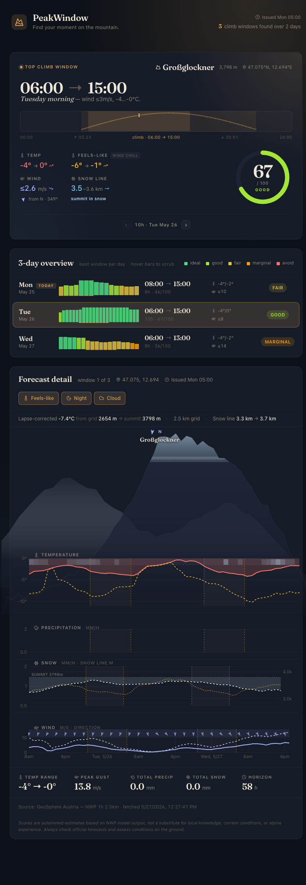

# PeakWindow MCP App

An MCP App that analyzes upcoming weather at alpine peaks and trailheads worldwide, ranking the best windows for climbing and ascent. Uses the best available forecast model for each region: GeoSphere Austria AROME (2.5 km) for Central Europe, MeteoSwiss ICON-CH2 (2 km) for the Alpine region, Météo-France AROME (2.5 km) for France, and Open-Meteo globally (~11 km).



## What it does

- Fetches hourly forecasts (temperature, precipitation, wind, gusts, cloud cover, snow line) from the best available provider for the requested coordinates
- Automatically selects the highest-resolution model: GeoSphere (2.5 km, Central Europe), MeteoSwiss (2 km, Alpine region), Météo-France (2.5 km, France), or Open-Meteo (~11 km, global)
- Falls through to the next provider on API failure for resilience
- Lapse-corrects temperatures to summit elevation using model terrain derived from surface pressure (-6.5 °C/km)
- Scores each hour against alpine climbing thresholds and identifies contiguous good-weather windows
- Serves an interactive UI (React, uPlot charts) as an MCP App resource with horizon tape, mountain profile, and Ventusky-style chart panels

## Requirements

This is an **MCP App** — it requires an MCP host that supports the [Apps protocol](https://apps.extensions.modelcontextprotocol.io/) to render its interactive UI. Compatible hosts include:

- [Claude Desktop](https://claude.ai/download) (macOS / Windows)
- [ChatGPT](https://chatgpt.com/) (via OpenAI Apps SDK)
- Any chat client implementing the MCP Apps spec

The server runs as a standard MCP server over **stdio** or **SSE**. The rich UI (charts, horizon tape, mountain profile) renders inline in any compliant host. Without one you still get the scored text output.

[Live UI demo (static mock data)](https://byteoverdev.github.io/peak-window-mcp-app/)

## Setup

### Claude Desktop

Add to your `claude_desktop_config.json`:

```json
{
  "mcpServers": {
    "peak-window": {
      "command": "npx",
      "args": ["tsx", "/path/to/peak-window-mcp-app/main.ts", "--stdio"]
    }
  }
}
```

Then ask Claude something like: *"What's the best weather window to climb Großglockner this week?"*

### Manual / development

```bash
npm install
npm run build
npm run serve          # HTTP + SSE transport
npm run serve:stdio    # stdio transport
```

For development with hot reload:

```bash
npm run dev
```

## MCP tool

**`peak-window`** — provide `lat`, `lon`, and optionally `peakName` and `summitElevationM`. Returns scored hours, top weather windows, and a full time-series payload rendered by the embedded UI.

## Data sources

| Provider | Resolution | Coverage | Via |
|---|---|---|---|
| [GeoSphere Austria](https://data.hub.geosphere.at/) | 2.5 km | Central Europe (5.5–22.1°E, 43–51.8°N) | Direct API |
| [MeteoSwiss ICON-CH2](https://open-meteo.com/en/docs/meteoswiss-api) | 2 km | Alpine region (0.5–16.5°E, 43–49.9°N) | Open-Meteo |
| [Météo-France AROME](https://open-meteo.com/en/docs/meteofrance-api) | 2.5 km | France & surrounds (-9–14°E, 38–55°N) | Open-Meteo |
| [Open-Meteo](https://open-meteo.com/) | ~11 km | Global | Direct API |
